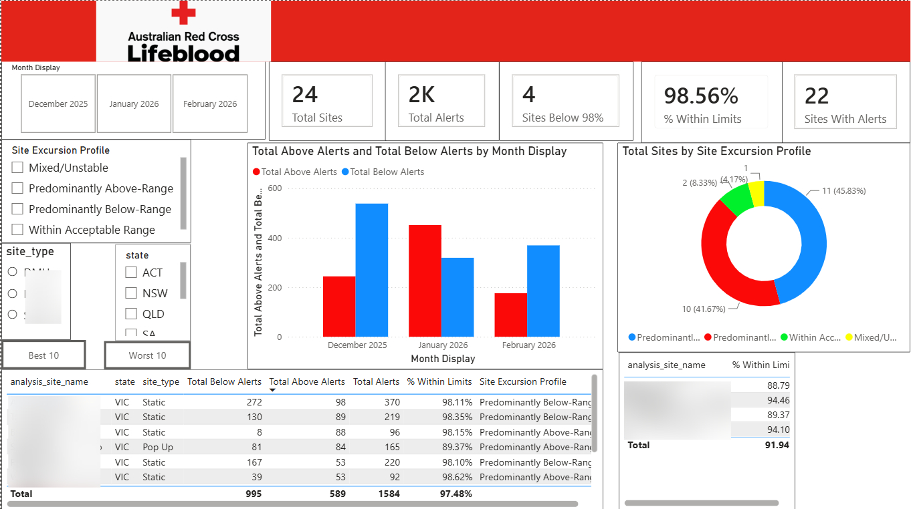
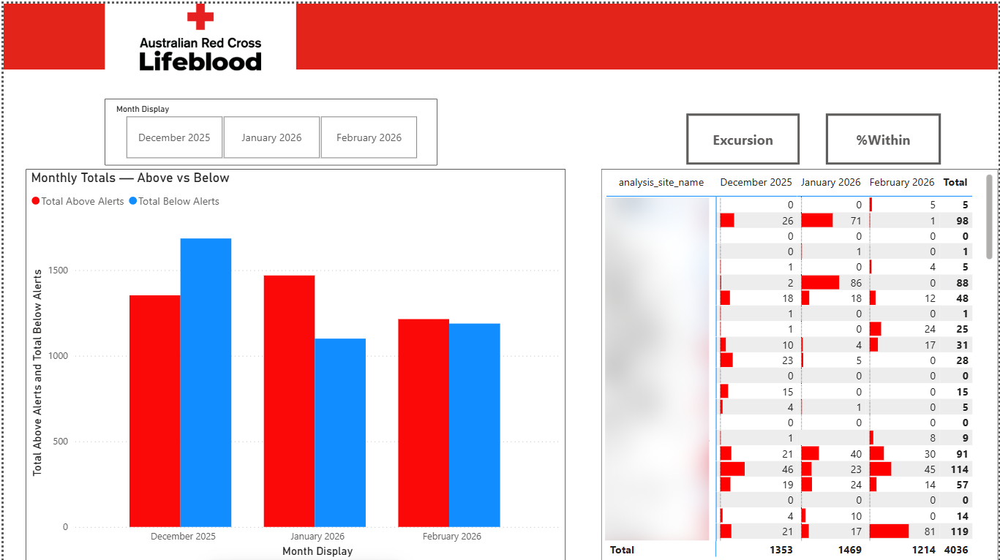
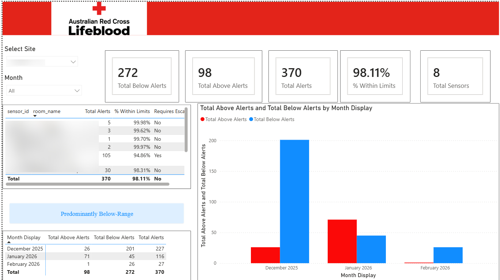
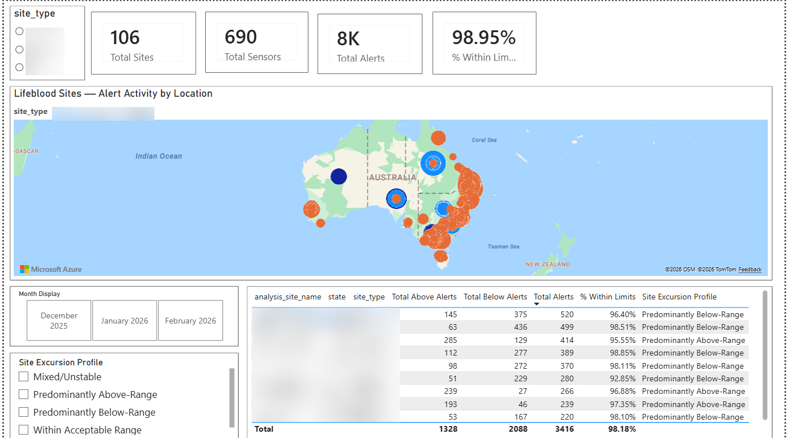
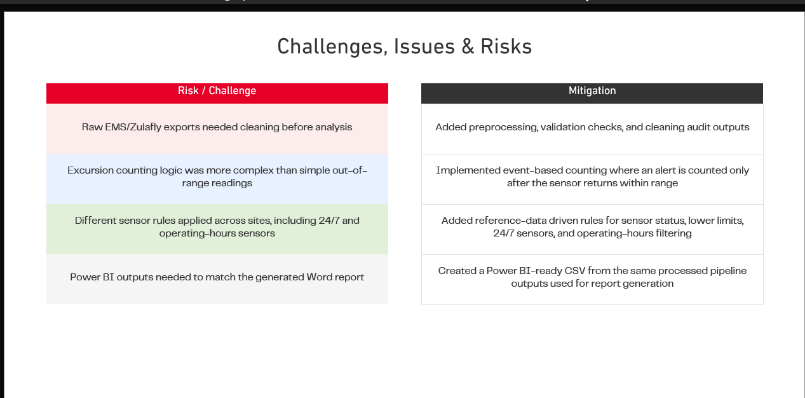

# Environmental Monitoring Dashboard | Australian Red Cross Lifeblood

Industry project | Power BI | DAX | Power Query (M) | Data Modelling

A 4-page Power BI dashboard that tracks temperature alerts from sensors across Lifeblood donor sites, so the team can see which sites and sensors are drifting out of range, how alert activity changes month to month, and where to focus follow-up.

> **Note:** Site names, sensor IDs and room names have been blurred to protect confidential client data. The figures shown are for demonstration of the dashboard design and logic only.



---

## Problem

Lifeblood monitors temperature sensors at its donor sites to make sure blood products are stored within safe limits. Alert data was exported from the Zulafly sensor platform, but reviewing it meant working through raw exports with no consolidated view of:

- which sites had the most alerts
- whether a site's issues were mostly above range, below range, or mixed
- how alert activity was trending across months
- which individual sensors needed escalation

## My role

I owned the Power BI layer end to end:

- Data modelling and relationships
- Power Query (M) transformations
- DAX measures and KPI logic
- Report design across all 4 pages

The Python preprocessing pipeline was built by teammates and produced the cleaned, Power BI-ready dataset I modelled on top of.

## Dashboard pages

### 1. Overview
KPI cards for total sites, total alerts, sites below the 98% target, % readings within limits and sites with alerts. Includes a monthly above vs below alert trend, a site excursion profile breakdown, and Best 10 / Worst 10 site rankings with slicers for month, site type and state.


### 2. Monthly Comparison
Month by month totals of above and below range alerts, with a site-level matrix showing how each site's alert count changed across December 2025, January 2026 and February 2026. Toggle buttons switch the matrix between excursion counts and % within limits.



### 3. Sitewise Comparison
Drill into a single site: KPI cards for that site, a sensor-level table showing alerts, % within limits and whether a sensor requires escalation, the site's excursion profile, and its monthly alert trend.



### 4. Map View
National view of alert activity by location, with bubble size showing alert volume and colour showing site type. Paired with a site-level table for quick comparison.



## Key features

- **Site Excursion Profile:** classifies each site as Predominantly Above-Range, Predominantly Below-Range, Mixed/Unstable or Within Acceptable Range, based on the balance of its alerts
- **98% within-limits target:** flags sites falling below the target
- **Best 10 / Worst 10 rankings** using DAX ranking measures
- **Sensor escalation flag** at sensor level
- **Interactive slicers** for month, site type , state and excursion profile

## Challenges and how they were solved

| Challenge | Solution |
|---|---|
| Raw EMS/Zulafly exports needed cleaning before analysis | Preprocessing, validation checks and cleaning audit outputs |
| Excursion counting was more complex than simple out-of-range readings | Event-based counting, where an alert is counted only once the sensor returns within range |
| Different sensor rules applied across sites, including 24/7 and operating-hours sensors | Reference-data driven rules for sensor status, lower limits, 24/7 sensors and operating-hours filtering |
| Power BI figures had to match the automated Word report | Power BI-ready CSV built from the same processed pipeline outputs used for report generation |



## Tools

| Area | Tools |
|---|---|
| Visualisation | Power BI Desktop |
| Data transformation | Power Query (M) |
| Measures and logic | DAX |
| Data modelling | Star-style model with site, sensor and month dimensions |
| Upstream pipeline (team) | Python |
| Source data | Zulafly sensor platform exports |

## Full dashboard

All 4 pages in one file: [Lifeblood_EMS_Dashboard.pdf](docs/Lifeblood_EMS_Dashboard.pdf)

## Repository structure

```
lifeblood-ems-dashboard/
├── README.md
├── images/
│   ├── 01_overview.jpeg
│   ├── 02_monthly_comparison.jpeg
│   ├── 03_sitewise_comparison.jpeg
│   ├── 04_map_view.jpeg
│   └── 05_challenges_and_mitigations.png
└── docs/
    └── Lifeblood_EMS_Dashboard.pdf
```

## Contact

**Aniruddha Pandit** | Data Analyst | Melbourne, VIC

- LinkedIn: https://www.linkedin.com/in/aniruddha-pandit-5b572b245/
- GitHub: [github.com/AniruddhaPandit](https://github.com/AniruddhaPandit)
- Portfolio: [datascienceportfol.io/aniruddhagppandit](https://www.datascienceportfol.io/aniruddhagppandit)
